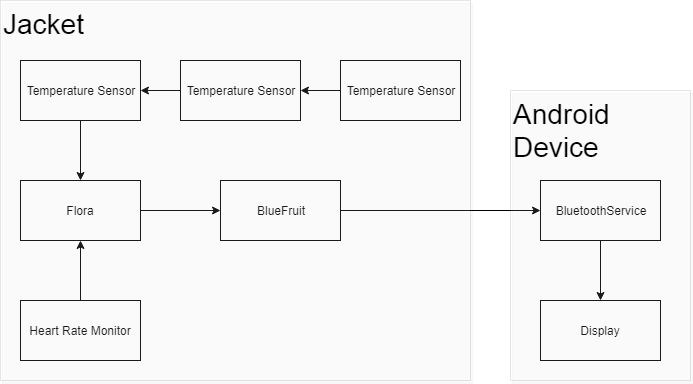
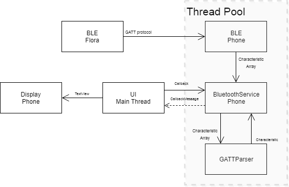

# Technical Document
# Health and Wellbeing Monitor
### Michal Dudinik
### James Toolen

### Table of contents

## 1. Introduction

#### Overview
    
The Health and Wellbeing Monitor portrays to its user information collected from sensors in a garment. The information is analysed by a tiny computer in the jacket and passed on an Android mobile telephone. Where upon the data will be asessed and displayed numerically for the user to observe.

#### Glossary

**Microcontroller**
Very small computer on single integrated circuit board

**Flora**
Small microcontroler board from Adafruit company used mostly as wearable device or sewn into the clothes.

**GitLab**
Online Git repository manager running on server, where users have access to these files and can collaborate.

**LCD**
Liquid Crystal Display, used mostly in computer display screens.

**GPS**
Global Positioning System is satelite based navigation system which provide location to GPS receiver anywhere on the Earth.

**BLE**
Bluetooth Low Energy Wireless technology standard to exchange data over short distances.

**I2C bus**
Inter-Integrated Circuit, simple and flexible way to transfer digital data between two electronic devices

**3V**
3 volts, or 3 units of electric potential.

**SDA**
Serial Data, conductive wire in I2C for transfering data

**SCL**
Serial Clock, conductive wire in I2C for transfering data

**GND**
Ground or earth, reference point in electrical circuit from which voltages are measured.hone.

**GATT**
Generic Attribute protocol used for communicating with BLE

**UUID**
Universally Unique Identifier a 126-bit number used to identify information in computer systems

**UART**
Universal Asynchronous Receiver/Transmitter a circuit in a microcontroller

## 2. System Architecture

A wearable, but not waterproof micro processing unit called a Flora, developed by AdaFruit. Has attatched to it a heart rate sensor, a multitude of temperature sensors and a bluetooth device to transmit the data from the different sensors.

The User will wear a jacket or a jumper, with:
 - Flora microprocesser
 - Bluefruit LE bluetooth
 - 3 LM35 Temperature sensors
 - Heart Rate light sensor
 - Battery holder with connector and switch

sewn into the chosen garment.

An Adroid phone application with a low energy bluetooth connection to receive data from the Bluefruit LE and display the information on the phones' screen.

Phones used for the testing of the application were:

- HTC one M8api 23 marshmallow
- HTC Desire 825 api 23 marshmallow

Emulators used in the testing of the application were:

- Nexus 5

The phone application provided for interaction with the jacket consists of three main activities:

- Greeting screen
- Personal settings screen
- Sensor monitor screen

The greetings screen is an activity containing a list with the other two activities as the options
The personal settings screen is an activity containg a list of editable and read only choices allowing to user to enter their personal information needed for the smooth running of the product.
From the entries into the height and weight categories the body mass index is calculated and displayed
The Sensor monitor screen is were the magic happens, once selected and the screen is displayed a background service starts and connects to the jackets bluetooth advertisement.
The monitor screen is then updated when the jackets sensors change.

## 3. High-Level Design

---

## 4. Problems and Resolution

Understanding and coming to terms with Androids architecture proved to be challenging at first.
Communicating with the main thread.
Communicating with the bluetooth protocol and then getting those communications back to the main thread to update the display screen.
With perserverence, sleepless nights and gigabytes of reverse engineered likened code we powered through with sheer relentless brute force.
Busy schedules, poor project management, budget constraints all had a part in a hectic final few weeks. The initial plan was to have three clones some unplanned for costs meant we had to be careful with just one.
Schedules and responsibilities resticted any prolonged gathering and collaboration and therefore nothing less than copious amounts of coffee was needed at times when nana wouldnt allow during the final sprint. Unfortunatly this also played a part into not keeping in touch with our supervisor as regular as we would have liked and we tried to make up for it by badgering him a little late on.

## 5. Installation Guide

The Health and Wellbeing application has been designed for Android release version Android 6.0 Marshmallow. It should work in some lower versions back to Android 4.3 JellyBean. In Android 4.3 and later, the Android Bluetooth stack provided the ability to implement Bluetooth Low Energy (BLE).

To install the Health and Wellbeing Android phone APK
There are different ways to install an android app on your phone:
- [ ] The Easiest way is to download the application from the Android Market or from the website directly to the SD card mounted in your phone, then click on the APK file to install it.
- [ ] The next way is to download the APK file to your computer, mount your phone's SD card in the computer (or connect the phone with SD inserted in it to the computer via a USB cable) and apply the APK file to the SD card, then insert the SD card in the phone and install the APK file from the SD card using an Application Installer or File Manager that you can download from the Android market.

1. #### The Easy Way
    This method requires:
   * Internet service on Android phone
   * A gmail.com account to access the Android market
   * An SD card inserted into the phone
- Open the Android Market application in the Applications menu. If you have never accessed the Android Mrket before you will be prompted for the login and password of your gmail.com account. Enter this information to create a market account.
- Within the Android Market, you can select the appropriate option on the menu bar to locate the application you want to install.
-- Applications displays a categorised list of all applications available on the market.
-- Games shows a categorised list of all the available games.
-- Download lists the APK files you have already downloaded
- Use Search (magnifying glass) to quickly find The Health and Wellbeing application. You will get a list of matching applications along with each ones description and rating
- Click on the application and more details are displayed
- To install the Health and Wellbeing application, just click on the install button on the bottom of the screen.
- In the next screen, you will see more details about the application including the different functionalities it needs to access.
- Click OK to finish the installation process

2. #### The Next Way
      This method requires:
   * Internet service to your Android phone
   * A browser
   * An SD card inserted in the phone
- Open the Applications menu (tab in the bottom centre of the phone's home screen)
- Click on the Settings application
- Check the first selection, Unknown Sources is checked so you are able to install an APK file from a location other than the Android Market.
- A warning message will be displayed, select OK to continue. You can change this setting back once the Heath and Wellbeing app is installed.
- Open the phones browser and navigate to http://student.computing.dcu.ie Where the Health and Wellbeing app as been made available for download
- Click the download link and download the application directly to your SD card, you should see a message that says "Starting download"
- In the upper left-hand corner of the screen, an animated download pointing arrow will display. When the animation stops, the download has completed.
- Click the arrow and you should see the newly dowloaded HealthandWellbeing.apk file name listed in the Notifications section. (If the arrow doesnt open the Notifications list, return to the home screen and pull down the Status bar at the top of the screen to see the list)
- Click on HealthandWellbeing file. A new screen will appear giving you more details ablut the application including the different functionalities it will need permission to access
- To install the Health and Wellbeing application just click on the install button at the bottom of the screen
- Once the installation is complete a new screen is displayed where you can choose to run the application immediately

### To Install the Jacket:
- Place left arm into left sleeve
- And again with the right arm into the right sleeve
- Fix as comfortable around the shoulders
- Tighten as required the left wristband
- Flick battery pack switch to On.
