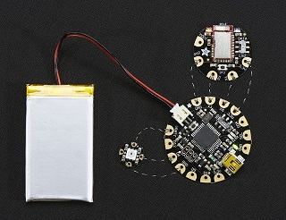
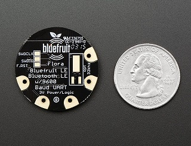

# Technical Specification
### Health and Wellbeing Monitor
##### Michal Durinik
##### James Toolen

### Table of contents

1.	Introduction
1.1	Overview
1.2	Glossary

2.	System Architecture

3.	High-Level Design

4.  Problems and Resolution
4.1 Setting-up Arduino IDE on Linux
4.2 At commands and GATT services
4.3 Flora memory capacity
4.4 Getting an app to connect to BLE peripheral
4.5 Reading GATT sensor data by an app
5. Installation Guide

## 1. Introduction

##### 1.1 Overview
    
The Health and Wellbeing Monitor portrays to its user information collected from sensors in a garment. The data is analysed by a tiny computer in the jacket and passed on an Android mobile telephone. At which point the data will be assessed and displayed numerically for the user to observe.

##### 1.2 Glossary

**Microcontroller**
A very small computer on single integrated circuit board

**Flora**
Small microcontroller board from Adafruit company used mostly as a wearable device or sewn into the clothes.

**GitLab**
Online Git repository manager running on the server, where users have access to these files and can collaborate.

**LCD**
Liquid Crystal Display, used mostly in computer display screens.

**Oled**
An Organic Light-Emitting Diode

**GPS**
Global Positioning System is satellite-based navigation system which provides a location to GPS receiver anywhere on the Earth.

**BLE**
Bluetooth Low Energy Wireless technology standard to exchange data over short distances.

**I2C bus**
Inter-Integrated Circuit, simple and flexible way to transfer digital data between two electronic devices

**3V**
3 volts, or 3 units of electric potential.

**SDA**
Serial Data, conductive wire in I2C for transferring data

**SCL**
Serial Clock, conductive wire in I2C for transferring data

**GND**
Ground or earth, a reference point in an electrical circuit from which voltages are measured.

**GATT**
Generic Attribute protocol used for communicating with BLE

**UUID**
Universally Unique Identifier a 126-bit number used to identify information in computer systems

**UART**
Universal Asynchronous Receiver/Transmitter a circuit in a microcontroller

**AT**
AT commands("Attention") are a subset of Hayes commands. They are short text strings which can be combined to produce commands for operations such as dialling, hanging up, and changing the parameters of the connection

## 2. System Architecture

A wearable, but not waterproof microprocessing unit called a Flora, developed by AdaFruit. Has attached to it a heart rate sensor, a multitude of temperature sensors and a Bluetooth device for transmitting the data from the different sensors.

The User will wear a jacket or a jumper, with:
 - Flora microprocessor
 - Bluefruit LE Bluetooth
 - 3 LM35, 1 DS18B20 Temperature sensors
 - Heart Rate light sensor
 - Battery holder with connector and switch

sewn into the chosen garment.

An Adroid phone application with a low energy bluetooth connection to receive data from the Bluefruit LE and display the information on the phones' screen.

Phones used for the testing of the application were:

- HTC one M8api 23 marshmallow
- HTC Desire 825 api 23 marshmallow

Emulators used in the testing of the application were:

- Nexus 5

The phone application provided for interaction with the jacket consists of three main activities:

- Greeting screen
- Personal settings screen
- Sensor monitor screen

The greetings screen is an activity containing a list with the other two events as the options
The personal settings screen is an activity providing a list of editable and read-only choices allowing to user to enter their personal information needed for the smooth running of the product.
From the entries into the height and weight categories, the body mass index is calculated and displayed
The Sensor monitor screen is where the magic happens, once selected and the screen is displayed a background service starts and connects to the jackets Bluetooth advertisement.
The monitor screen is then updated when the jackets sensors change.

## 3. High-Level Design

---

## 4. Problems and Resolution

##### 4.1 Setting-up Arduino IDE on Linux
Setting up permissions to communicate with the Flora board.

Adding user to these groups: adm, uucp, lock, tty
> gpasswd -a $USER uucp

Making lock owner of lock group
> chown root:lock /run/lock

Finally give permission to write in /run/lock to its owner 
> chmod g+w /run/lock

Disabling this service before starting Arduino IDE
> sudo systemctl stop ModemManager.service

##### 4.2 At commands and GATT services
Lots of documentation reading was necessary to understand how to send commands to Bluetooth module, such as setting up heart rate monitor service advertisement
> AT+GATTADDSERVICE=UUID=0x180D

##### 4.3 Flora memory capacity
We had to swap temperature sensor LM35 to DS18B20 temperature module due to measurement fluctuations of up to 15 °C. New libraries had to be imported and our compiled Flora binary file exceeded 29KB. 
Disabling or reducing the number of features was necessary to reduce size. Some of them were using up to 3% of entire system memory
* printout to serial port for debugging reduced
* display text animations and logo disabled
* display draw calls reduced, the way of displaying information was restructured and optimised heavily
* changing temperature variable Type from float to integer decreased memory by 3%, but also its precision. This change was reverted as more memory was freed elsewhere and we kept two decimal precision.
* BLE debugging messages and feedback reduced

##### 4.4 Getting an app to connect to BLE peripheral
This was proven to be the most challenging task of the project. To get a better understanding of the topic, we read official Google documentation profoundly. 

However, some of the information was outdated and methods used in examples deprecated. 
We read and tried to understand every guide we could find online on the topic.
Countless code snippets were tested.

##### 4.5 Reading GATT sensor data by an app
Even though the connection was established and GATT services visible and readable, GATT connection services flag was set as false and data weren't passed on to write callback.

By setting it as true it allowed information to be passed to read call back.

We had to use short Type for data instead of an integer as it was 2-byte value to extract heart rate measurements.

## 5. Installation Guide

The Health and Wellbeing application has been designed for Android release version Android 6.0 Marshmallow. It should work in some lower versions back to Android 4.3 JellyBean. In Android 4.3 and later, the Android Bluetooth stack provided the ability to implement Bluetooth Low Energy (BLE).

To install the Health and Wellbeing Android phone APK
There are different ways to install an android app on your phone:
- [ ] The Easiest way is to download the application from the Android Market or the website directly to the SD card mounted in your phone, then click on the APK file to install it.
- [ ] The next way is to download the APK file to your computer, mount your phone's SD card in the computer (or connect the phone with SD inserted in it to the computer via a USB cable) and apply the APK file to the SD card, then insert the SD card in the phone and install the APK file from the SD card using an Application Installer or File Manager that you can download from the Android market.

1. #### The Easy Way
    This method requires:
   * Internet service on Android phone
   * A gmail.com account to access the Android market
- Open the Android Market application in the Applications menu. If you have never accessed the Android Market before you will be prompted for the login and password of your gmail.com account. Enter this information to create a market account.
- Within the Android Market, you can select the appropriate option on the menu bar to locate the application you want to install.
-- Applications displays a categorised list of all apps available on the market.
-- Games shows a categorised list of all the available games.
-- Download lists the APK files you have already downloaded
- Use Search (magnifying glass) to quickly find The Health and Wellbeing application. You will get a list of matching applications along with each one's description and rating
- Click on the app, and more details are displayed
- To install the Health and Wellbeing application, click on the install button on the bottom of the screen.
- In the next screen, you will see more details about the app including the different functionalities it needs to access.
- Click OK to finish the installation process

2. #### The Next Way
      This method requires:
   * Internet service to your Android phone
   * A browser
- Open the Applications menu (tab in the bottom centre of the phone's home screen)
- Click on the Settings application
- Check the first selection, Unknown Sources is checked so that you can install an APK file from a location other than the Android Market.
- A warning message will be displayed, select OK to continue. You can change this setting back once the Heath and Wellbeing app is installed.
- Open the phone's browser and navigate to http://student.computing.dcu.ie Where the Health and Wellbeing app has been made available for download
- Click the download link and download the application directly to your phone memory, you should see a message that says "Starting download"
- In the upper left-hand corner of the screen, an animated download pointing arrow will display. When the animation stops, the download has completed.
- Click the arrow, and you should see the newly downloaded HealthandWellbeing.apk file name listed in the Notifications section. (If the arrow doesn't open the Notifications list, return to the home screen and pull down the Status bar at the top of the screen to see the list)
- Click on HealthandWellbeing file. A new screen will appear giving you more details about the application including the different functionalities it will need permission to access
- To install the Health and Wellbeing application just click on the install button at the bottom of the screen
- Once the installation is complete, a new screen is displayed where you can choose to run the application immediately

