# User Manual
## Health and Wellbeing Monitor
### Michal Durinik
### James Toolen

The purpose of this document is to instruct the user in the smooth operation of the Health and Wellbeing Monitor application and hardware device

Instructions to install Health and Wellbeing Monitor application:

To install the Health and Wellbeing Android phone APK
There are different ways to install an android app on your phone:
- [ ] The Easiest way is to download the application from the Android Market or from the website directly to the SD card mounted in your phone, then click on the APK file to install it.
- [ ] The next way is to download the APK file to your computer, mount your phone's SD card in the computer (or connect the phone with SD inserted in it to the computer via a USB cable) and apply the APK file to the SD card, then insert the SD card in the phone and install the APK file from the SD card using an Application Installer or File Manager that you can download from the Android market.

1. #### The Easy Way
    This method requires:
   * Internet service on Android phone
   * A gmail.com account to access the Android market
   * An SD card inserted into the phone
- Open the Android Market application in the Applications menu. If you have never accessed the Android Market before you will be prompted for the login and password of your gmail.com account. Enter this information to create a market account.
- Within the Android Market, you can select the appropriate option on the menu bar to locate the application you want to install.
-- Applications displays a categorised list of all applications available on the market.
-- Games shows a categorised list of all the available games.
-- Download lists the APK files you have already downloaded
- Use Search (magnifying glass) to quickly find The Health and Wellbeing application. You will get a list of matching applications along with each ones description and rating
- Click on the application and more details are displayed
- To install the Health and Wellbeing application, just click on the install button on the bottom of the screen.
- In the next screen, you will see more details about the application including the different functionalities it needs to access.
- Click OK to finish the installation process

2. #### The Next Way
      This method requires:
   * Internet service to your Android phone
   * A browser
   * An SD card inserted in the phone
- Open the Applications menu (tab in the bottom centre of the phone's home screen)
- Click on the Settings application
- Check the first selection, Unknown Sources is checked so you are able to install an APK file from a location other than the Android Market.
- A warning message will be displayed, select OK to continue. You can change this setting back once the Health and Wellbeing app is installed.
- Open the phones browser and navigate to http://student.computing.dcu.ie Where the Health and Wellbeing app as been made available for download
- Click the download link and download the application directly to your SD card, you should see a message that says "Starting download"
- In the upper left-hand corner of the screen, an animated download pointing arrow will display. When the animation stops, the download has completed.
- Click the arrow and you should see the newly downloaded HealthandWellbeing.apk file name listed in the Notifications section. (If the arrow doesnt open the Notifications list, return to the home screen and pull down the Status bar at the top of the screen to see the list)
- Click on Health and Wellbeing file. A new screen will appear giving you more details about the application including the different functionalities it will need permission to access
- To install the Health and Wellbeing application just click on the install button at the bottom of the screen
- Once the installation is complete a new screen is displayed where you can choose to run the application immediately

### To Install the Jacket:
- Place left arm into left sleeve
- And again with the right arm into the right sleeve
- Fix as comfortable around the shoulders
- Tighten as required the left wristband
- Flick battery pack switch to On.

# **Hardware description**

|Connect battery pack to Jacket||
|---|---|
|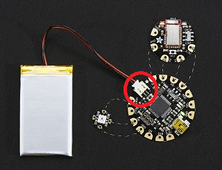|Connect the battery pack cable to the Flora microcomputer as indicated by the red circle|

|Turning the jacket on||
|---|---|
|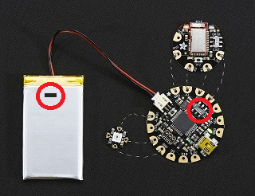|Please make sure that both the battery pack and the Flora micro computer are switch into the On position. Switches can be found as indicated by the red circles.|

# **Software description**

|Permissions||
|---|---|
|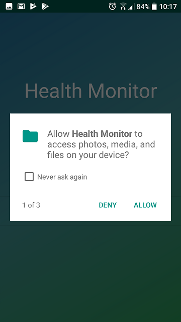| In order to gain the best possible experience with the Health and Wellbeing Monitor Application and Hardware, it is necessary to grant the phone application certain permissions  Permissions Needed: - Bluetooth Connection|

|Welcome Screen||
|---|---|
|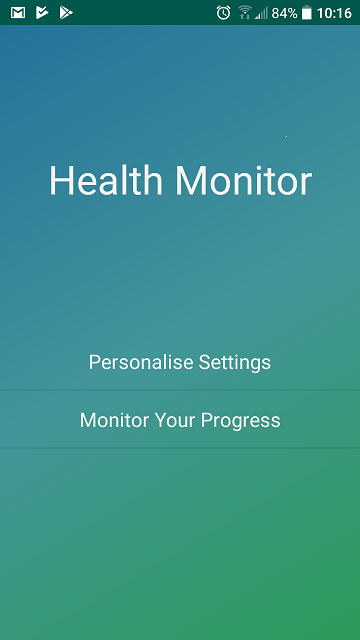|Start the Health and Wellbeing Monitors APK application on your phone You will be taken to welcome screen with two choices Choices are: - Personal Settings - Monitor Progress|

|Settings Screen||
|---|---|
|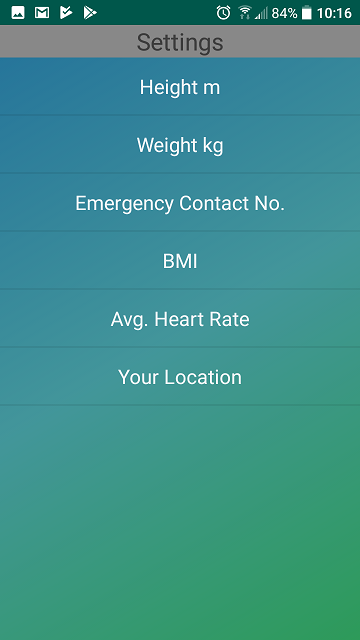|The personalise setting screen gives multiple options of information entry Options include: - Height - Weight - Emergency Contact Number - Body Mass Index - Average Heart Rate - Your Location|

|Height, Weight, BMI||
|---|---|
|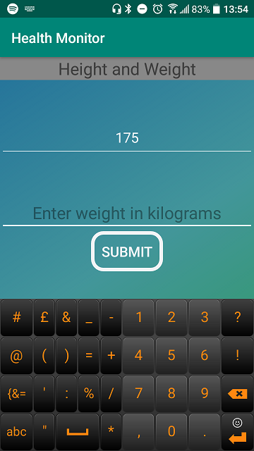|Choosing Height, Weight or Body Mass Index will all take you to another screen. Displayed on this screen are two text entry screens were you should type in your details and press submit.|

|Height, Weight, BMI||
|---|---|
|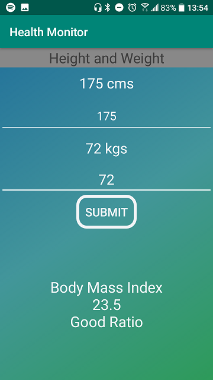|After pressing the submit button your Body Mass Index ratio will appear on screen|

|Sensor Monitor Screen||
|---|---|
|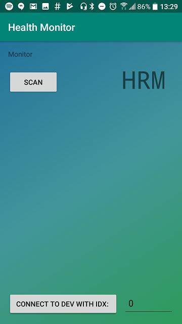|Back at the Main Welcome screen this is what you would receive if the Monitor Progress option is selected.  A screen with two buttons: - The first starts a scan - The second is for connecting to your Health and Wellbeing Jacket once discovered by the scan.|

|Sensor Monitor Screen||
|---|---|
|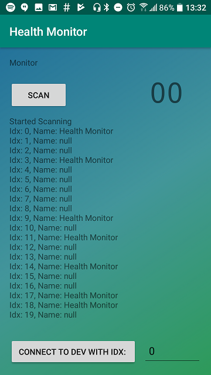|Once scan button is clicked the Health and Wellbeing Monitor will scan for available Low Energy connections and display this list to the the screen.  Take note of the idx number for the Health Monitor.|

|Sensor Monitor Screen||
|---|---|
|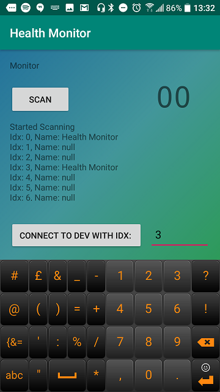| Take that noted indexnumber and enter it into the text field and press the connect button|

|Sensor Monitor Screen||
|---|---|
|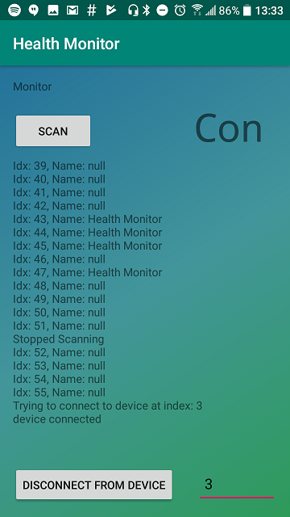|Once the connection between phone and Jacket is succesful a C or Con will be displayed on the top right of the screen|

|Sensor Monitor Screen||
|---|---|
|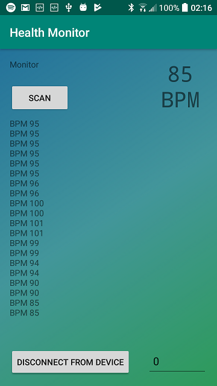|Viola displayed for your perusal your heart rate|

